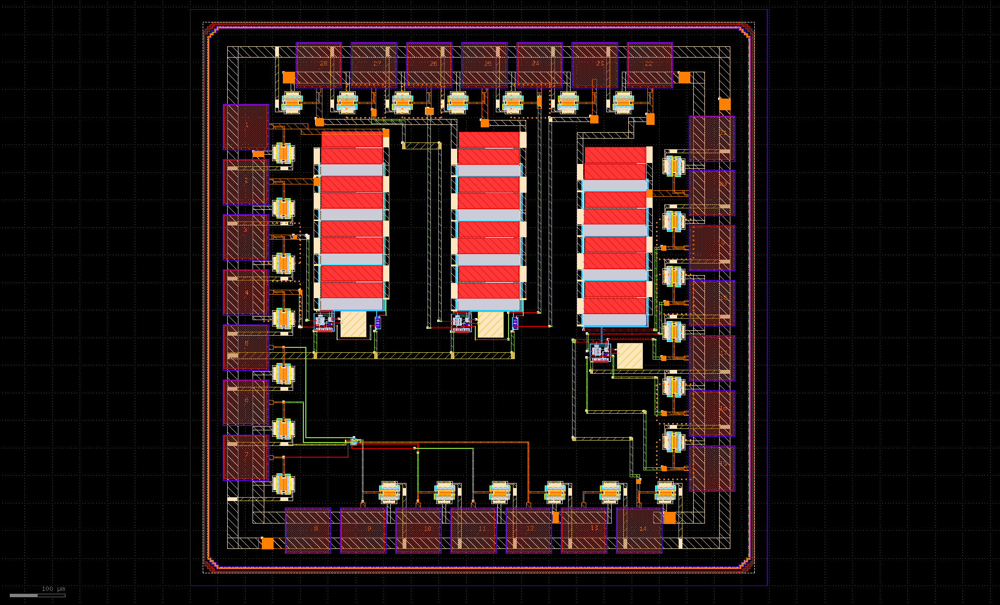
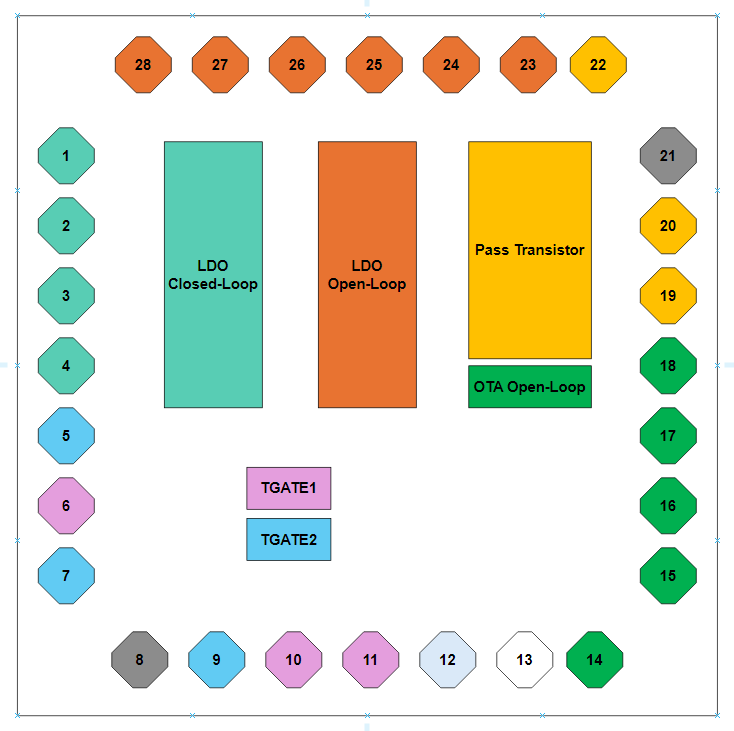

# LDO - Design example for IHP - Open Source PDK.

> © Daniel Arevalos, Innovations for High Performance Microelectronics (IHP).

This is a design made as an example for the IHP-Open-PDK technology.



### Directory Structure

```
├─ 📁 klayout
├─ 📁 xschem
├─ 📁 python
├─ 📁 results
└─ 📄Makefile.mk
```

### Overview

The design consist in:

1. LDO_Closed-loop: low dropout regulator with feedback loop 
2. LDO_Open-loop: low dropout regulator with the feedback loop opened.
3. Pass transistor: The pass transistor used in the LDO. 
4. OTA Open-Loop: Two stage Transconductance amplifier used in the LDO design.
5. TGATE1: transmission gate for testing.
6. TGATE2: transmission gate for testing. 




| Pin Name     | Type         | Description                              |
| ------------ | ------------ | ---------------------------------------- |
| Vout_ldo_cl  | Analog       | LDO CL design output            |
| Vin_ldo_cl   | Power Supply | LDO CL design Input voltage     |
| Vref_ldo_cl  | Analog       | LDO CL design Voltage reference |
| ibias_ldo_cl | Analog       | LDO CL design ibias current     |
| TGATE1_IN    | Analog       | Tgate1 input                             |
| TGATE2_IN    | Analog       | Tgate2 input                             |
| TGATE1_EN    | Digital      | Tgate1 enable                            |
| Vss          | Power Supply | Global Ground                            |
| TGATE1_OUT   | Analog       | Tgate1 output                            |
| TGATE2_OUT   | Analog       | Tgate2 output                            |
| TGATE2_EN    | Digital      | Tgate2 enable                            |
| TGATE_VDD    | Power Supply | Tgate1 and Tgate2 power supply           |
| NOT USED     |              |                                          |
| vdd_ota      | Power Supply | OTA power supply                         |
| ibias_ota    | Analog       | OTA bias current                         |
| in_pos_ota   | Analog       | OTA positive input                       |
| out_ota      | Analog       | OTA output                               |
| in_neg_ota   | Analog       | OTA negative input                       |
| Vgate_pt     | Analog       | Pass Transistor Gate                     |
| Vdrain_pt    | Analog       | Pass Transistor Drain                    |
| Vss          | Power Supply | Global Ground                            |
| Vsource_ota  |              | Pass Transistor source                   |
| vdiv_ldo_ol  | Analog       | LDO OL volage divider output      |
| pos_ldo_ol   | Analog       | LDO OL positive input             |
| Vout_ldo_ol  | Analog       | LDO OL output voltage             |
| ibias_ldo_ol | Analog       | LDO OL bias current               |
| vref_ldo_ol  | Analog       | LDO OL voltage reference          |
| Vin_ldo_ol   | Power Supply | LDO OL power supply               |

