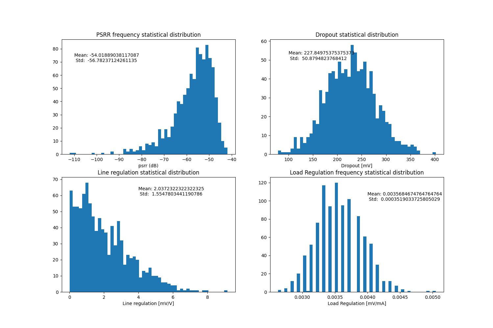

.. _LDO_monte_carlo:

LDO Monte Carlo
==========

Overview
------------

This section provides documentation for running simulations on the LDO module to evaluate its performance characteristics such as PSRR, phase margin, and open-loop gain. A Python script is used to automate the simulations and generate relevant figures.

To run the Python script, navigate to the folder containing the schematic testbench files and use the following command in your terminal:

.. code-block:: sh

    python3 run.py

Monte Carlo Simulations
------------

Monte Carlo simulations are used to statistically evaluate the performance variations of the LDO module. By running multiple instances of simulations with random variations in the parameters, we can understand how the LDO behaves under different conditions. This helps in assessing the robustness and reliability of the design.

In this section, we perform Monte Carlo simulations for both closed-loop and open-loop parameters. The key metrics analyzed include:

- **Closed-Loop Parameters**: Such as PSRR, line regulation, load regulation, and dropout.
- **Open-Loop Parameters**: Including open-loop gain and phase margin.

The following figures show the distribution of these parameters based on the Monte Carlo simulations. Each histogram provides a visual representation of the variation and spread of the respective parameter, helping to identify the statistical range and average performance.

  Monte Carlo closeloop histograms

  Monte Carlo openloop histograms