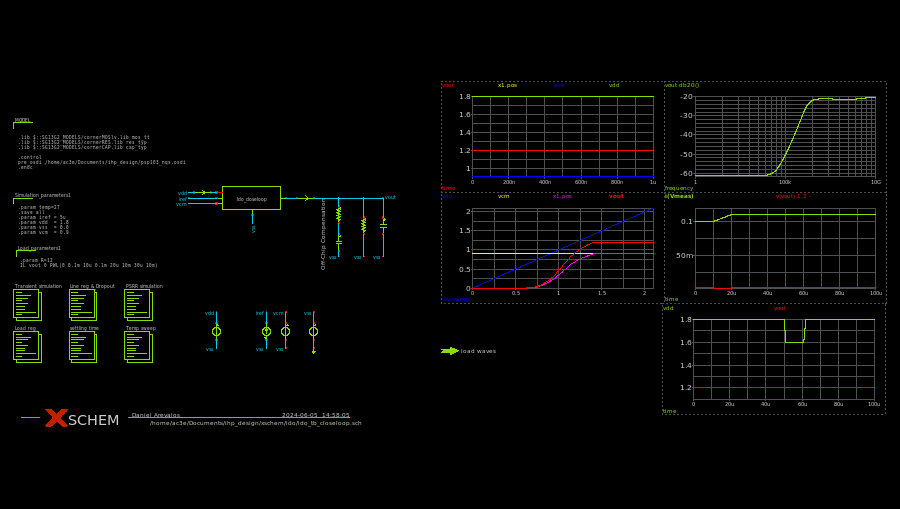
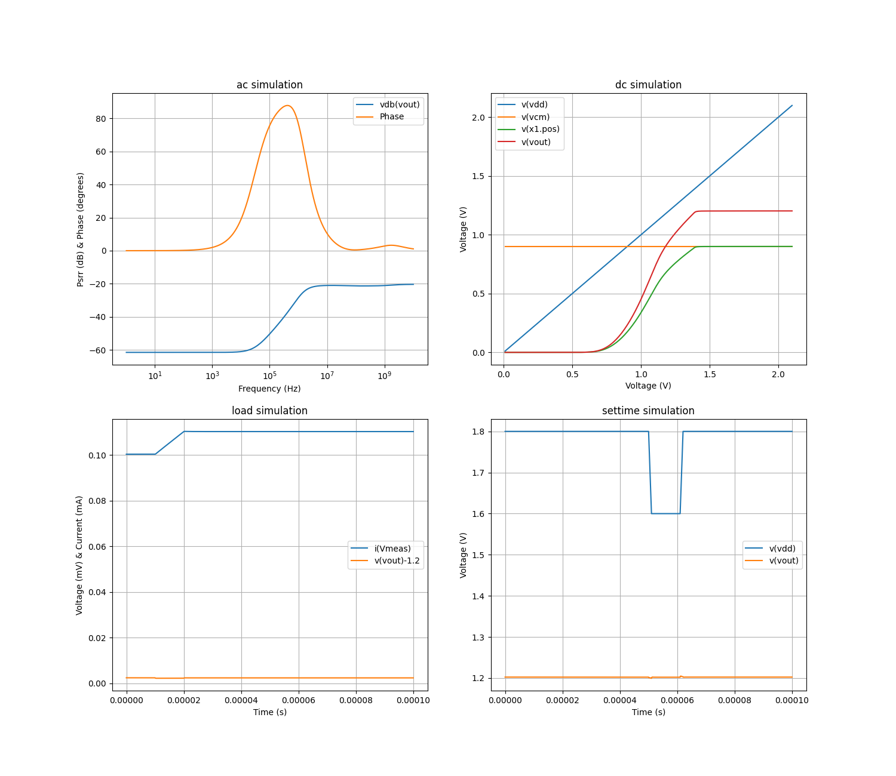
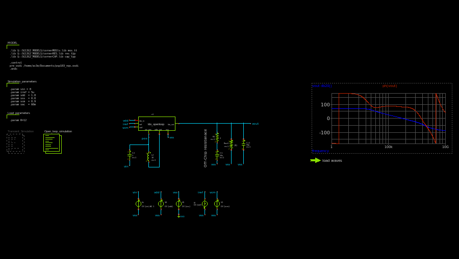
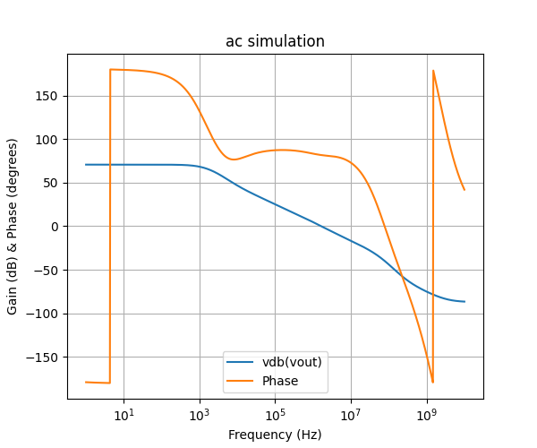

.. _LDO_simulation:

LDO Simulation
==========

Overview
------------

This section provides documentation for running simulations on the LDO module to evaluate its performance characteristics such as PSRR, phase margin, and open-loop gain. A Python script is used to automate the simulations and generate relevant figures.

To run the Python script, navigate to the folder containing the schematic testbench files and use the following command in your terminal:

.. code-block:: sh

    python3 run.py

Closed-Loop Simulations
------------

  LDO close-loop simulation schematic

The closed-loop simulations performed on the LDO module include:

- **AC Simulation**: Used to evaluate the Power Supply Rejection Ratio (PSRR).
- **DC Simulation**: Used to evaluate line regulation and PSRR.
- **Load Simulation**: Used to evaluate load regulation.
- **Transient Simulation**: Used to evaluate the transient response of the LDO.

Each of these simulations provides insight into a specific aspect of the LDO's performance. The following figures illustrate the results of these simulations, offering a visual representation of the LDO's behavior under various conditions.

.. _ldo_closeloop:

  LDO PSRR

From this simulations the following table of specs is extracted:

+---------------------------+-------+
| Parameter                 | Value |
+===========================+=======+
| Dropout Voltage (mV)      | 246   |
+---------------------------+-------+
| Line Regulation (mV/V)    | 0.94  |
+---------------------------+-------+
| Load Regulation (mV/mA)   | 0.004 |
+---------------------------+-------+
| Quiscient Current (uA)    | 47    |
+---------------------------+-------+

Open-Loop Simulations
------------

  LDO open-loop simulation schematic

The open-loop simulations performed on the LDO module include:

- **AC Simulation**: Used to extract the open-loop gain and phase margin.

The AC simulation for open-loop analysis provides critical insights into the stability and performance of the LDO. The following figure illustrates the open-loop gain and phase margin.

  LDO Open-Loop Stability

+--------------------------+-------+
| Parameter                | Value |
+==========================+=======+
| Loop Gain (dB)           | 72.8  |
+--------------------------+-------+
| Phase Margin (degrees)   | 64.6  |
+--------------------------+-------+